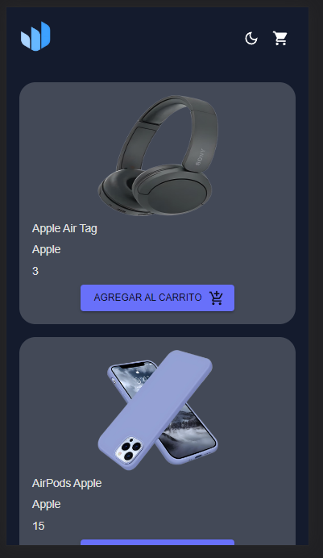
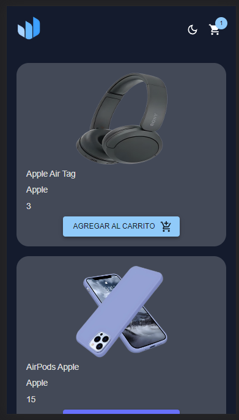
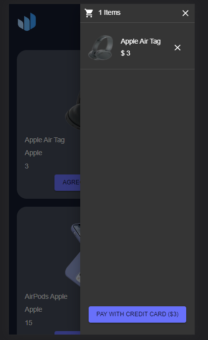
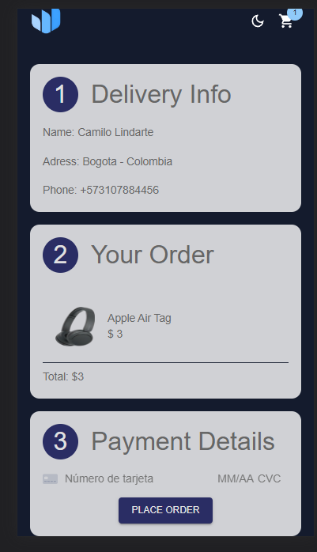
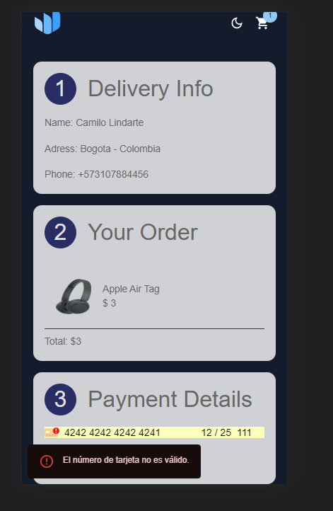
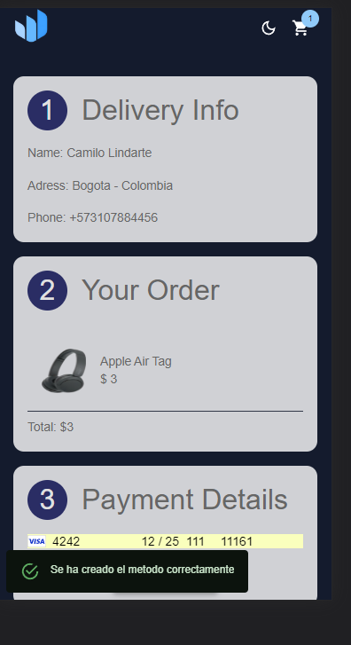

<h1>Credit Card Payment</h1>

    </img>

<h1>Como Correr el proyecto</h1>
<li>Posicionate en la carpeta donde clonaste el repositorio y ejecuta <code>npm install</code></li>
<li>En una terminal  Posicionate en la carpeta que clonaste y ejecuta <code>npm start</code></li>
</ul>

<h1>RESUMEN</h1>

    Estas fueron todas las configuraciones que debes hacer para correr el proyecto. Ahora vas a poder buscar el clima de las ciudades deseadas.

    En este pequeño ecommerce puedes agregar un producto al carrito de compras lo cual permite agregar mas de 1 cantidad de cada producto.
    La aplicacion fue diseñada First Movile con lo cual cierve para una pantalla como referencia Iphone SE.

    </img>

    producto en el carrito

    </img>

    Al momento de ir a la pasarela de pagos el metodo de pago por defecto es una tarjeta de credito para efectos practicos se toma como ejemplo la tardjeta numero 4242 4242 4242 4242 con cualquier fecha posterior a la fecha actual y cualquier CVC.

    </img>

    En dado caso de error si la tarjeta no cumple con los parametros esta mostrara un PopUp con la informacion del error. 
    Y si la compra es exitosa muestra un PopUp exitoso.

    </img>

    </img>

<h1>RESPONSIVE</h1>

    La aplicacion cuenta con responsive web referencia Iphone SE mejor experiencia de usuario 

    <h1> TECNOLOGIAS USADAS </h1>
        <h2>FRONTEND</h2>
        <ul>
            <li>React </li>
            <li>React hooks</li>
            <li>Redux</li>
            <li>Redux hooks</li>
            <li>MUI (Material ui)</li>
            <li>stripe (Validacion de pagos)</li>
            <li>Testing Library</li>
            <li>Jest</li>
        </ul>

